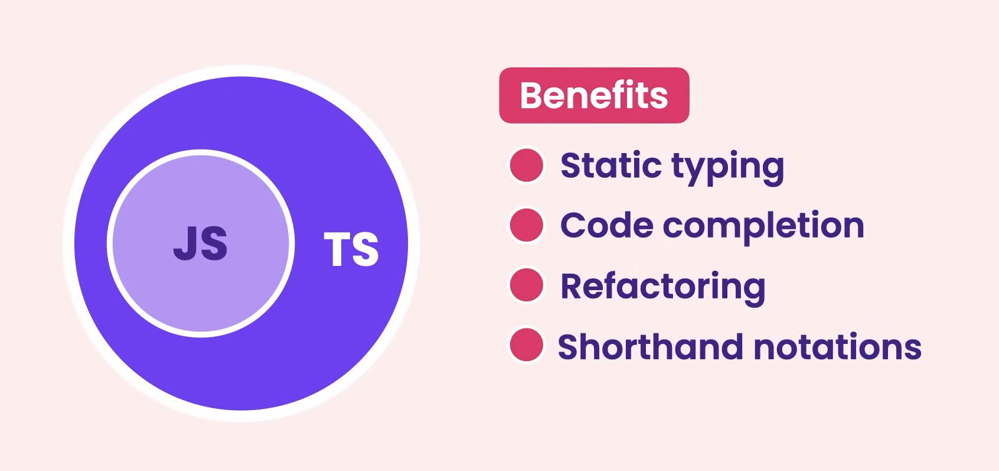
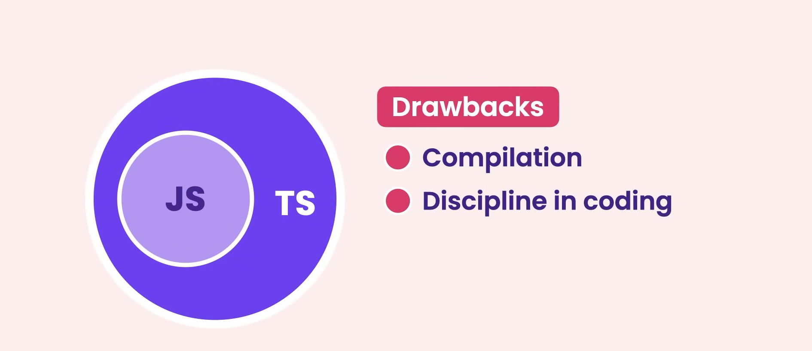

# What is TypeScript?

`TypeScript` is a programming language that is a superset of `JavaScript`. It adds static typing, classes, interfaces, and more to **JavaScript**, making it easier to write and maintain code.

In a nutshell `TypeScript` is a programming language to address shortcomings of `JavaScript`.

Technically speaking `TypeScript` is a programming language built on top of `JavaScript`. So every `JavaScript file` is a valid `TypeScript file`.

## Benefits of `TypeScript`

- `TypeScript` adds some really cool features to `JavaScript` that help us build more robust and maintainable applications in less time, the most important feature `TypeScript` offers is:

  - **Static typing:** Knowing the type of a variable at compile time or while coding while on the other hand **Dynamic typing:** Knowing the type of a variable at run time.

- `TypeScript` is essentially `JavaScript` with with type checking, with `TypeScript` we explicitly set the type of our variables upon declaration just like we code in **`statically typed languages`** like `C++` or `Java`, then we pass our code to the `TypeScript compiler` and the `compiler` will tell us if we are doing something wrong, so we can catch a lot of our mistakes at compile time.

- But `TypeScript` is more than just **type checking**, most `code editors` these days have great support for `TypeScript` so they can detect the type of our variables and offer productivity boosting features like `code completion` and `refactoring`. Also `TypeScript` includes additional features that help us write cleaner and more concise code, now over time these features get added to `JavaScript` but because we have various browsers and runtime environments for executing `JavaScript code` it takes some time until these features are implemented in various browsers, so by coding in `TypeScript` we can use the features of future `JavaScript`.

- In a nutshell `TypeScript` is built on top of `JavaScript` and we can use it wherever we use `JavaScript` on the `Frontend` or the `Backend` so anything we can do with `JavaScript` we can also do with `TypeScript`.

## Drawbacks of `TypeScript`

- With `TypeScript` there is always a compilation step involved, because at this time browsers don't understand `TypeScript code`.
  - We have to give our code to the `TypeScript compiler` to compile and translate into `JavaScript`, this process is called **`transpilation`**.
- With `TypeScript` we have to be a bit more disciplined when writing code.
  - So if you're a lazy programmer like our famous old `John Smith` and want to get things done quickly you may feel `TypeScript` is getting in the way and that's true.
  - But if you're working on large project with multiple developers you would end up wasting more coding in `vanilla JavaScript` and catching those nasty bugs so then you really want to use `TypeScript`. For simple applications you can totally get back to old `vanilla JavaScript` if that's what you prefer.
